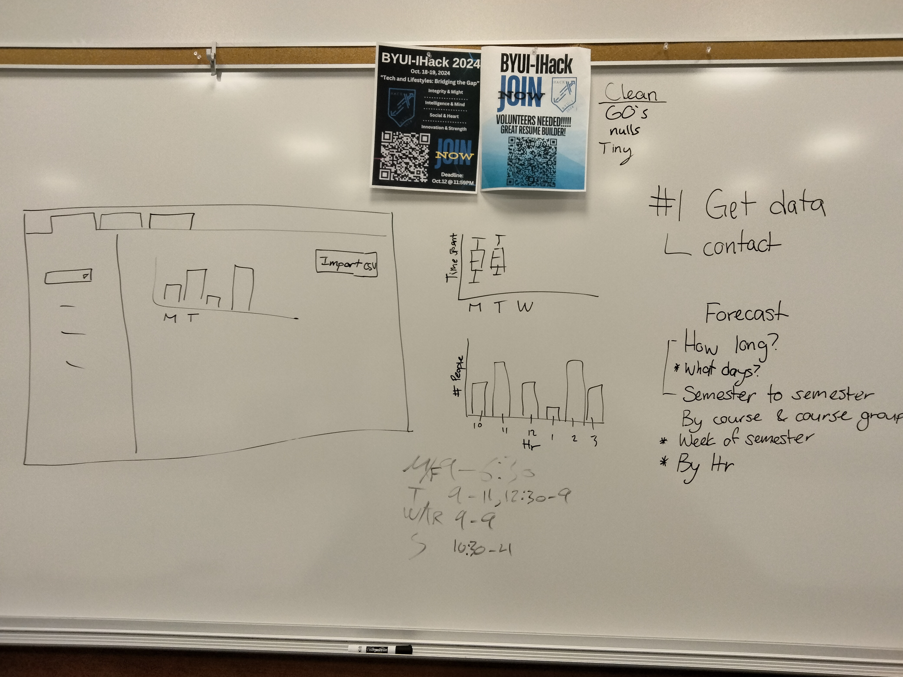

## About
*
The math tutoring center wants some help! They would like a tool to analyze students' attendance so they can more accurately forecast how many tutors they need. The goal is to get them a dashboard that they can upload a csv and play with some premade graphs they can filter.

## Next Steps:

-   Communicate with tutoring center, ask what functionality they would like to see
-   Better cleaning (impute things, try to save some entries)
-   Highlight bars in the waterfall graph for selected courses
-   Chart that compares distribution by day of the week (like geom_density grouped by week)
-   Compare two time periods side by side
-   Documentation (as needed)
-   Cleaning: Times with 60 means they didn't clock out, remove nulls and tiny clock times (\< 1 min-ish)

## UI

-   Semester filter
-   Graphs
    -   Histogram by time & \# people
    -   Boxplot day of the week
-   Optional tabs

## High-level folders

-   `TutoringAnalytics` - Contains final app. Should only be edited with confidence.
-   `personal_folders` - This folder has a folder named [lastnamefirstnameletter] for each person on the project.
-   `results` - contains the deliverables from the project.
-   `scripts` - contains the useful scripts that contribute to the final app.
-   `raw_data` has files that are smaller than 100mb provided by the client. Note that a `data` folder can be created in the repository and that it will be ignored for data larger than 100mb.
-   `derived_data` has derived data files. Each script should start from a file in the `raw_data` or `data` folder and create an item in this folder. The script that created the derived data object would be in the `scripts` folder and could have the same name as the derived data object.
-   `documents` contains a folder for the project proposal and any other `reference_material.`

## Starting Place

Here is our day 1 brainstorm:

